  

Hi!, I'm Shaun.

- 🔭 I’m currently working on ... An interactive video library management application
- 🌱 I’m currently learning ... Golang, Nim, SQL, data structures/algorithms, UI/UX and system design.
- 🤔 I’m curious about ... Odin, Rust and Gleam
- 👯 I’m looking to collaborate on ... Various projects and ideas
- 👀 I'm interested in ... Linux, coding, networking and AI
- ❤️ I'm passionate about ... Open-source, free-software and technology in general
- 🥳 I'm really into ... Digital painting, music, audio engineering, and forever perfecting my Neovim config 
- 🎸 I'm usually listening to ... Rock or Metal (ask me about my favourite band)

<!--
**sjclayton/sjclayton** is a ✨ _special_ ✨ repository because its `README.md` (this file) appears on your GitHub profile.

Here are some ideas to get you started:

- 🤔 I’m looking for help with ...
- 💬 Ask me about ...
- 📫 How to reach me: ...
- 😄 Pronouns: ...
- ⚡ Fun fact: ...
-->
